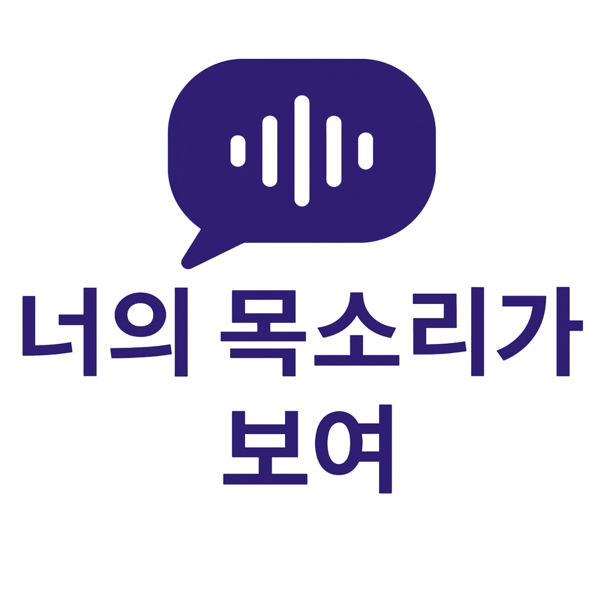

# 🎙️ DeepVoice Frontend

> **딥보이스 탐지 & 보이스피싱 방지 서비스**  
> 프론트엔드 개발자: **우지윤**, **이현진**

<p align="center">
  
</p>

---

## 📌 프로젝트 개요
이 저장소는 **DeepVoice 서비스의 Frontend 코드**입니다.  
React 기반 SPA로 개발되었으며, 백엔드 API와 연동하여 **음성 업로드 → 분석 → 결과 확인 → 위험 대응**까지의 흐름을 제공합니다.  

---

## 🛠 기술 스택
- **Framework**: React (CRA 기반)  
- **Styling**: SCSS (모듈화)  
- **상태 관리**: React Hooks  
- **아이콘/UI**: lucide-react, react-icons  
- **기타**: html2canvas (화면 캡처), JWT(LocalStorage)  

---

## 📂 프로젝트 구조
```bash
FE-jiyun/
 ├── .gitignore
 ├── README.md
 ├── package-lock.json
 ├── package.json
 ├── public/
 │   ├── Mainlogo.png
 │   ├── MainlogoWhite.png
 │   └── index.html
 └── src/
     ├── App.js                # 라우팅 및 메인 앱 컴포넌트
     ├── index.js              # React 엔트리 포인트
     ├── assets/               # 스타일 및 정적 리소스
     ├── components/           # 재사용 가능한 컴포넌트
     │   ├── Home.jsx          # 홈 화면 컴포넌트
     │   └── VoiceUpload.jsx   # 음성 업로드 컴포넌트
     ├── pages/                # 주요 페이지 (추가 예정)
     └── store/                # API 및 데이터 관리
         ├── analyses.mock.js  # 테스트용 mock 데이터
         ├── client.js         # http client 설정
         └── endpoint.js       # API endpoint 정의

✨ 주요 기능

✔️ 회원 인증: JWT 기반 로그인 및 세션 유지
✔️ 음성 업로드: 파일 업로드 및 녹음 지원
✔️ 분석 결과: 보이스피싱 여부 및 위험도 표시
✔️ 위험 대응: 112 신고 버튼, 결과 이미지 캡처 저장
⚙️ 실행 방법
1. 의존성 설치
npm install

2. 개발 서버 실행
npm start
→ http://localhost:3000 에서 확인 가능

3. 빌드
npm run build

🔗 API 연동
기본 API 주소: .env 파일에서 VITE_API_BASE 환경 변수로 관리
VITE_API_BASE=https://deepvoice-be.shop


